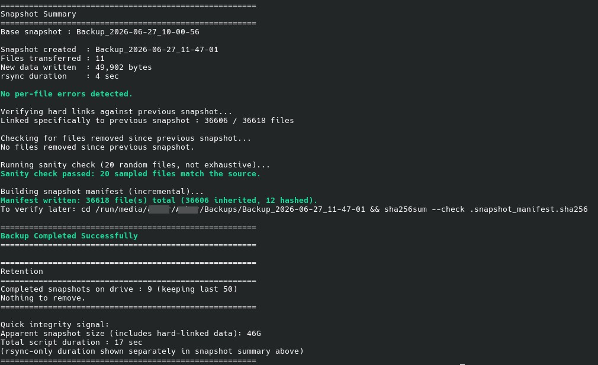

# Snapshot Backup (Engine v5)

A lightweight snapshot-based backup system for Linux using rsync and hard links.

Each backup appears as a complete copy of your files, while unchanged files are shared between snapshots using hard links. This provides Time Machine-style versioned backups without duplicating unchanged data.

**Features**
- Snapshot-based backups
- Hard-link deduplication using rsync --link-dest
- Incremental storage growth
- Restore by simple file copy
- Snapshot integrity manifests (SHA-256)
- Incremental manifest generation
- Automatic retention policy
- External drive detection
- Source/destination overlap protection
- Concurrent-run protection (file locking)
- Optional per-folder .backupignore
- Sanity-check verification after backup
- Detailed logging
- Requirements

**Required:**
- Linux
- Bash 4+
- rsync
- coreutils
- findutils

**Optional:**
- notify-send
- upower
- shuf
- Filesystem Support

**Recommended:**
- ext4
- xfs
- btrfs

**Not recommended for snapshot mode:**
- exfat
- vfat
- ntfs

*These filesystems do not reliably support hard links and may cause snapshots to become full copies rather than space-efficient incremental snapshots.*

How It Works
First Backup

The first run creates a complete baseline snapshot.

**Example:**

Backups/

└── Backup_2026-06-27_10-00-56/

**Subsequent Backups**

Later backups use:

- rsync --link-dest=<previous_snapshot>
- Unchanged files are hard linked to the previous snapshot.
- Changed files are copied normally.

**Result:**

Backups/

├── Backup_2026-06-27_10-00-56/

├── Backup_2026-06-28_10-00-22/

└── Backup_2026-06-29_10-00-11/

*Each snapshot appears complete, but unchanged files occupy space only once on disk.*

**Restoring Files**

- No special restore process exists.

**Browse to the desired snapshot:**

Backups/

└── Backup_<timestamp>/

**Then copy files back using:**

- Dolphin
- Nautilus
- Thunar
- cp
- rsync

**Example:**

*cp Backup_2026-06-27_10-00-56/Documents/report.pdf ~/Documents/*

Entire folders can be restored the same way.

Snapshot Verification

**Every snapshot contains:**

- .snapshot_manifest.sha256

**To verify a snapshot:**

- cd Backup_<timestamp>
- sha256sum --check .snapshot_manifest.sha256

A successful verification should report all files as OK and produce no FAILED entries.

**Example:**

- ./Documents/report.pdf: OK
- ./Pictures/photo.jpg: OK

Configuration

**Optional source list:**

- ~/.config/snapshot-backup/sources.conf

One source path per line:

- ~/Documents
- ~/Pictures
- ~/Videos

Blank lines and comments beginning with # are ignored.

If no configuration file exists, the script uses its built-in default source list.

- .backupignore Support

Place a .backupignore file inside any source directory.

**Example:**

- *.tmp
- *.bak
- cache/

Rules apply only to that directory subtree.

The implementation uses rsync's native per-directory merge filter mechanism.

**Retention**

Snapshots are retained automatically.

Default:

***Keep the most recent 50 completed snapshots.***

Older snapshots are removed automatically.

Incomplete snapshots created by interrupted runs are cleaned up automatically.

**Design Philosophy**

Simple restore beats clever restore.
Every snapshot is directly browsable and restorable using standard Linux tools.

***This project intentionally avoids:***

- Databases
- Proprietary backup formats
- Catalog files
- Background daemons
- Network services
- Dedicated restore utilities

Snapshots are ordinary directories containing ordinary files.

If this script disappears tomorrow, backups remain accessible through any file manager or standard filesystem tools.

The primary goal is long-term recoverability rather than feature complexity.

**Security & Privacy**

This software operates entirely on local storage selected by the user.

**It does not:**

- Upload data to cloud services
- Transmit data over the network
- Collect telemetry
- Create user accounts
- Require internet access

***Integrity verification is performed using per-snapshot SHA-256 manifests generated and stored locally.***

All backup data remains under the user's control.

**Known Limitations**

- Renamed Files

*Renaming a file causes it to be rehashed during manifest generation.*

This does not affect correctness, only efficiency.

**Manifest Sorting**

Manifest generation performs a sort operation on each run.

At typical personal backup sizes this overhead is negligible.

**Timestamp Resolution**

Manifest inheritance relies on:

- inode
- size
- modification time

A file rewritten multiple times within the same timestamp resolution window and ending with the same size could theoretically inherit an outdated checksum.

In practice this is extremely unlikely on modern Linux filesystems.

## Important

This software has been tested on personal Linux systems and is provided as-is.

**Always follow the backup rule:**

If your data exists in only one place, it is not backed up.

Maintain at least one additional copy of important data.

## Disclaimer

Always test restores before relying on any backup solution.

This software is provided as-is without warranty. The author is not responsible for data loss, corruption, or damage resulting from its use.

Use at your own risk.

## Design Philosophy

Simple restore beats clever restore.

Every snapshot is directly browsable and restorable with ordinary file tools.
No databases, proprietary formats, catalogs, daemons, or restore utilities
are required.

## Attribution

This project is released under the MIT License.

If you redistribute or modify this project, please retain the original
copyright notice and license text as required by the license.

Forks, improvements, bug fixes, and derivative works are welcome.

Credit to the original project is appreciated.

## License

This project is licensed under the MIT License.

See the LICENSE file for details.

## Important

This software has been tested on personal Linux systems and is provided as-is.

Always follow the backup rule:

If your data exists in only one place, it is not backed up.

Maintain at least one additional copy of important data.

## Installation Instructions

installation instructions

chmod +x snapshot-backup.sh
mkdir -p ~/.local/bin
cp snapshot-backup.sh ~/.local/bin/

## Example Output

Incremental backup:

